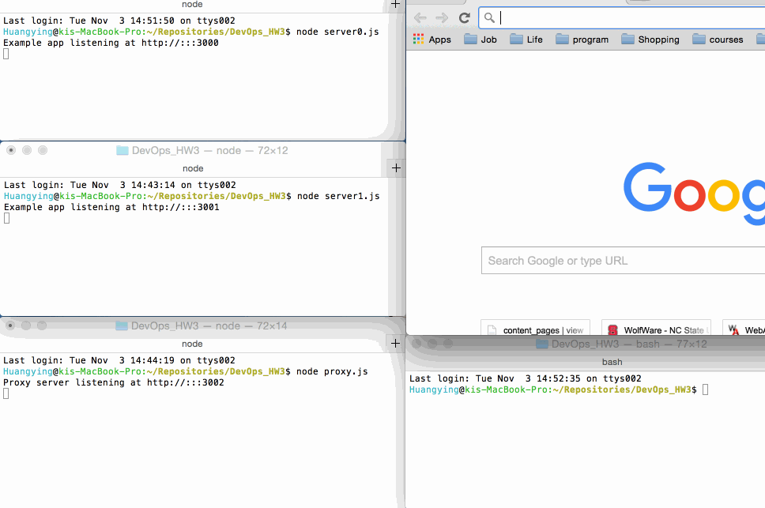

# HW #3 Proxies, Queues, Cache Fluency.


### Goal

Understanding the basic building blocks that form complex infrastructure is an important precedent to being able to construct and deploy it.

* Complete five routes: /set, /get, /recent, /upload, /meow.

* Run two instances of the service layer on different port.
 
* Create a proxy that will uniformly deliver requests to localhost/ to those two instances.

    
### Implementation

#### Routes

**/set route:**    

``` 
app.get('/set', function(req, res) {
  client.set("key", "This message will self-destruct in 10 seconds");
  client.expire("key",10);
  res.end();
}) 

```

**/get route:**    

``` 
app.get('/get', function(req, res) {
  client.get("key",function(err, reply) {
    // reply is null when the key is missing
    //console.log("Hello");
    if(reply == null)
    {
      res.send('There is no value for key');
    }
    else
    {
      res.send(reply);
    }
    });
}) 

```

**/recent route:**    

``` 
app.use(function(req, res, next) 
{
	console.log(req.method, req.url);

	client.rpush("recent",req.protocol + "://" + req.get('host') + req.originalUrl);
  client.ltrim("recent",0,4);
  console.log(req.method,req.protocol + "://" + req.get('host') + req.originalUrl);
	next(); // Passing the request to the next handler in the stack.
});


app.get('/recent', function(req, res) {
  client.lrange("recent",0,-1,function(err,reply)
  {
    console.log(reply);
    res.send(reply);
  });
})

```

**/upload route**

```
app.post('/upload',[ multer({ dest: './uploads/'}), function(req, res){
   console.log('req.body')
   console.log(req.body) // form fields
   console.log('req.files')
   console.log(req.files) // form files

   if( req.files.image )
   {
     console.log('in req.files.images')
	   fs.readFile( req.files.image.path, function (err, data) {
	  		if (err) throw err;
	  		var img = new Buffer(data).toString('base64');
	  		//console.log(img);
        client.lpush("images",img);

		});
	}
   res.status(204).end()
}]);

```

**/meow route**

```
app.get('/meow', function(req, res) {
	{
		//if (err) throw err
		res.writeHead(200, {'content-type':'text/html'});
		// items.forEach(function (imagedata) 
		// {
  //  		res.write("<h1>\n");
		// });
    client.lpop("images",function(err,reply)
   {
    if (err) throw err
    //console.log(reply);
    res.write("<h1>\n");
    res.end();
   });
  }
})

```

#### Servers


Proxy server( proxy.js ) running on port 3002.

```
function proxy(req,res){
  client.rpoplpush("servers","temp",function(err,item){
    if (err) throw err;
    console.log(item)
    res.redirect("http://localhost:"+item+req.url);
  });
  client.rpoplpush("temp","servers")
}
.
.
.
var server = app.listen(3002, function () {

  var host = server.address().address
  var port = server.address().port
  client.lpush("servers",3002)
  console.log('Proxy server listening at http://%s:%s', host, port)
})


```

Two identical servers( server0.js and server1.js ) running seperatly on port 3000 and 3001.

```

var server = app.listen(3000, function () {

  var host = server.address().address
  var port = server.address().port
  client.lpush("servers",3000)
  console.log('Example app listening at http://%s:%s', host, port)
})

```


### Instruction

Install all the dependencies:

` npm install ` 

Start the two servers and proxy:

` node server0.js`    
` node server1.js`   
` node proxy.js `  

Upload image in another teminal:

` curl -F "image=@./img/morning.jpg" localhost:3000/upload `

### Result




